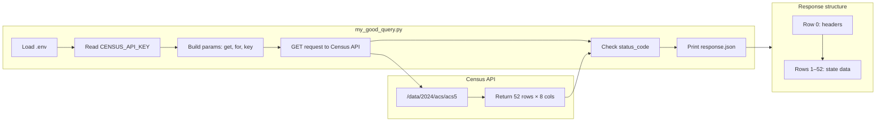
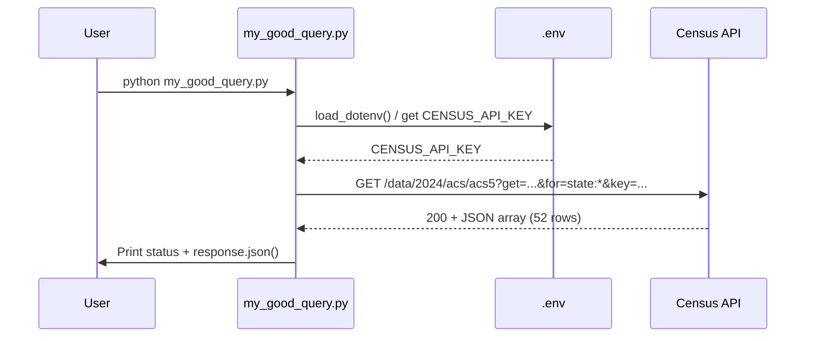

# Census ACS Citizenship Query — Documentation

## Overview

`my_good_query.py` is a Python script that calls the **U.S. Census Bureau American Community Survey (ACS) 5-Year Estimates** API to retrieve **citizenship-status demographics** for all U.S. states, the District of Columbia, and Puerto Rico. The result is a multi-row dataset suitable for reporting and analysis (e.g., dashboards, state-level comparisons, or demographic reports).

- **API:** U.S. Census Bureau – ACS 5-Year Estimates (2024)  
- **Data type:** Geographic / categorical (one row per state/territory)  
- **Record count:** 52 rows (50 states + DC + Puerto Rico)  
- **Use case:** Reporter-style applications, demographic analysis, state-level citizenship breakdowns  

---

## API Endpoint & Parameters

| Item | Value |
|------|--------|
| **Base URL** | `https://api.census.gov/data/2024/acs/acs5` |
| **Method** | GET |
| **Auth** | API key required (query parameter `key`) |

### Parameters

| Parameter | Description |
|-----------|-------------|
| `get` | Comma-separated list of variables: `NAME`, `B01001_001E`, `B05001_002E`, `B05001_003E`, `B05001_004E`, `B05001_005E`, `B05001_006E` |
| `for` | Geography: `state:*` (all states + DC + PR) |
| `key` | Your Census API key (loaded from `.env` as `CENSUS_API_KEY`) |

### Variable codes (citizenship table B05001)

| Code | Description |
|------|-------------|
| `NAME` | State/area name |
| `B01001_001E` | Total population |
| `B05001_002E` | U.S. citizen, born in the United States |
| `B05001_003E` | U.S. citizen, born in Puerto Rico or U.S. Island Areas |
| `B05001_004E` | U.S. citizen, born abroad of American parent(s) |
| `B05001_005E` | Naturalized U.S. citizen |
| `B05001_006E` | Not a U.S. citizen |

**Documentation:**  
- [ACS 5-Year Data Sets](https://www.census.gov/data/developers/data-sets/acs-5year.html)  
- [ACS Technical Documentation](https://www.census.gov/programs-surveys/acs/technical-documentation.html)  

---

## Data Structure

The API returns a **JSON array** where:

- **Row 0:** Column headers (variable names).
- **Rows 1–52:** One row per state/territory (50 states + DC + Puerto Rico).

### Shape

- **Rows:** 53 total (1 header + 52 data rows).  
- **Columns:** 8 (7 variables above + `state` FIPS code).

### Column layout

| Index | Header | Description |
|-------|--------|-------------|
| 0 | NAME | State/area name |
| 1 | B01001_001E | Total population |
| 2 | B05001_002E | Native-born U.S. citizens |
| 3 | B05001_003E | U.S. citizens born in PR/U.S. Island Areas |
| 4 | B05001_004E | U.S. citizens born abroad of American parent(s) |
| 5 | B05001_005E | Naturalized U.S. citizens |
| 6 | B05001_006E | Not U.S. citizens |
| 7 | state | State FIPS code |

All numeric fields are **estimates** (counts). Values are strings in the raw JSON; convert to integers for calculations.

---

## Mermaid Diagram



**Request → response flow:**



---

## Usage Instructions

### 1. Prerequisites

- **Python 3** with `requests` and `python-dotenv` installed:

  ```bash
  pip install requests python-dotenv
  ```

- A **Census API key** from [api.census.gov](https://api.census.gov/data/key_signup.html).

### 2. Configure API key

In the same directory as `my_good_query.py`, create a `.env` file:

```env
CENSUS_API_KEY=your_census_api_key_here
```

Do not commit `.env` or your key to version control.

### 3. Run the script

From the project directory (e.g. `5381-activities`):

```bash
python my_good_query.py
```

### 4. Expected output

- A line: `Status code: 200`
- Then the full response JSON: an array with one header row and 52 data rows (state name, total population, and six citizenship variables plus state FIPS).

### 5. Optional: Error handling

The script does not currently check `response.status_code` or `response.raise_for_status()`. For production or reporting pipelines, add checks and handle non-200 responses or missing `CENSUS_API_KEY` before using the JSON.

---

## Summary

| Item | Detail |
|------|--------|
| **Script** | `my_good_query.py` |
| **API** | U.S. Census Bureau ACS 5-Year (2024) |
| **Endpoint** | `https://api.census.gov/data/2024/acs/acs5` |
| **Records** | 52 (states + DC + PR) |
| **Key fields** | NAME, total population, 5 citizenship categories, state FIPS |
| **Config** | `CENSUS_API_KEY` in `.env` |
