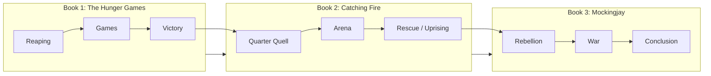

# The Hunger Games Series — README

## 📋 Overview

*The Hunger Games* is a young-adult dystopian trilogy by Suzanne Collins. It follows Katniss Everdeen in the nation of Panem as she becomes a symbol of rebellion against the Capitol.

- **Author:** Suzanne Collins  
- **Genre:** Young adult, dystopian, science fiction  
- **Books:** 3 ( *The Hunger Games*, *Catching Fire*, *Mockingjay* )  
- **Setting:** Panem (post-apocalyptic North America)  
- **Use case:** Reading order reference, series summary, key themes  

---

## 📚 Books

### Book 1: *The Hunger Games*

Katniss volunteers to replace her sister Prim in the annual Hunger Games. She and Peeta Mellark are tributes from District 12. Survival and the Capitol’s manipulation drive the plot.

### Book 2: *Catching Fire*

Victors are forced into a special Quarter Quell. Katniss’s actions spark unrest. The Capitol tightens control; the seeds of rebellion spread.

### Book 3: *Mockingjay*

War between the districts and the Capitol. Katniss becomes the Mockingjay—the face of the rebellion. The series concludes with the fall of the Capitol and its aftermath.

---

## 🗺️ World & Structure

### Panem

| Item | Detail |
|------|--------|
| **Capitol** | Central power; runs the Games and exploits the districts |
| **Districts** | 12 (formerly 13); each has a designated industry |
| **Hunger Games** | Annual televised event; 24 tributes fight until one survives |

### Key terms

| Term | Description |
|------|-------------|
| **Tribute** | One boy and one girl from each district chosen for the Games |
| **Victor** | Winner of the Hunger Games |
| **Mockingjay** | Symbol of rebellion; linked to Katniss |

---

## 📊 Series Arc

**Reading order:** Read in numerical order (1 → 2 → 3) to follow plot and character development.

<u>ex:</u> *The Hunger Games* (2008) → *Catching Fire* (2009) → *Mockingjay* (2010)

---

## 🔗 Documentation

- [Suzanne Collins – Official](https://www.suzannecollinsbooks.com/)  
- [The Hunger Games – Scholastic](https://www.scholastic.com/thehungergames/)  

---

## ✅ Summary

| Item | Detail |
|------|--------|
| **Series** | The Hunger Games trilogy |
| **Author** | Suzanne Collins |
| **Books** | *The Hunger Games*, *Catching Fire*, *Mockingjay* |
| **Protagonist** | Katniss Everdeen |
| **Setting** | Panem |
