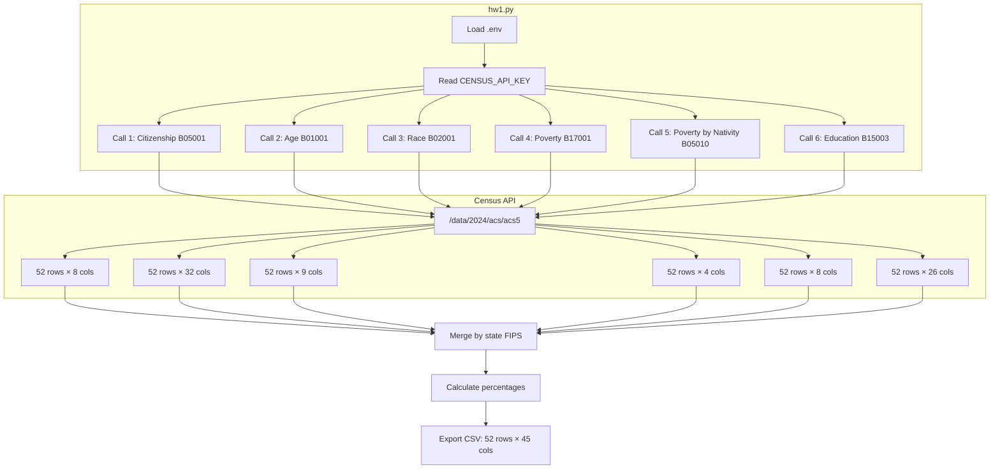
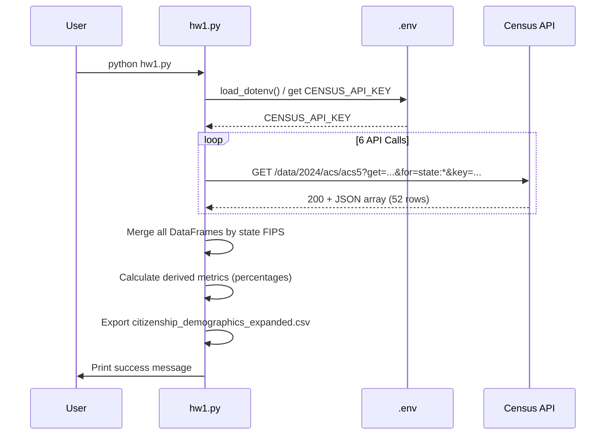

## Homework 1 – ICE & Demographics Tool Documentation

This document describes the data, technical details, and usage instructions for the Homework 1 toolchain: the Census/Vera data preparation scripts, the ICE & Demographics Shiny dashboard, and the AI reporting helper.

---

## Data Summary (Joined Dataset Columns)

The main dataset used by the dashboard and AI reporter is `census_vera_joined.csv`. It is a **state‑level** table created by combining expanded Census ACS data with Vera ICE detention facility counts. The table contains more fields than the dashboard directly shows; the variables below are the **primary columns surfaced in the app and/or used by the AI summaries.**

### Dataset overview

- **Unit of observation**: U.S. state (one row per state)
- **Key sources**:
  - U.S. Census Bureau ACS 5‑Year Estimates (demographics and nativity)
  - Vera Institute of Justice ICE detention facilities data
- **Typical record count**: 50 states + District of Columbia

### Key columns

| Column name              | Type      | Description                                                                 |
|--------------------------|-----------|-----------------------------------------------------------------------------|
| `state`                  | string    | State FIPS code (2‑digit string from Census).                              |
| `state_name`             | string    | Full state name (e.g., “California”).                                      |
| `state_abbr`             | string    | Two‑letter state abbreviation (e.g., “CA”).                                |
| `total_population`       | integer   | Total population estimate for the state.                                   |
| `non_citizen`            | integer   | Count of residents who are not U.S. citizens.                              |
| `pct_non_citizen`        | numeric   | Percent of residents who are non‑citizens.                                 |
| `foreign_born`           | integer   | Count of residents who are foreign‑born (regardless of citizenship).       |
| `pct_foreign_born`       | numeric   | Percent of residents who are foreign‑born.                                 |
| `ice_facility_count`     | integer   | Number of ICE detention facilities located in the state (from Vera).       |
| `pct_foreign_born`       | numeric   | Percent of residents who are foreign‑born.                                 |
| `pct_non_citizen`        | numeric   | Percent of residents who are non‑citizens.                                 |

Additional metrics (such as age structure, race/ethnicity breakdowns, poverty, and educational attainment) are included in `census_vera_joined.csv` but are not all directly visualized in the dashboard UI. They can be used for further analysis or extended visualizations if needed.

The AI reporter script (`ai_reporter_openai.py`) focuses especially on:

- `pct_foreign_born`
- `pct_non_citizen`
- `ice_facility_count`

These metrics are highlighted in the written narrative and bullet‑point takeaways.

---

## Technical Details

### Key scripts and files

- **`hw1.py`**  
  - Calls the Census ACS API (multiple tables) and builds an expanded state‑level demographics table.  
  - Produces intermediate CSV(s) with citizenship, age, race, poverty, and education metrics.

- **`join_census_vera.py`**  
  - Joins the expanded Census data to Vera ICE facility counts by state.  
  - Performs a **left join** from the Census demographics table to the Vera facilities table using `state_abbr` (Census) = `state` (Vera).  
  - Writes the main dataset used by both the dashboard and the AI reporter: `census_vera_joined.csv`.

- **`download_vera_national.py`**  
  - Downloads or prepares a national time‑series of ICE detention populations.  
  - Saves `data/national.csv`, used for the “National ICE detention trends” line chart.

- **`app.py`** (Shiny dashboard)  
  - Implements the **ICE & Demographics Dashboard** using Shiny for Python.  
  - Key components:
    - Left sidebar controls and filters.  
    - Choropleth map of the U.S. by state, with selectable metric:
      - `ice_facility_count`, `pct_foreign_born`, `pct_non_citizen`.  
    - Line chart of national ICE detention trends from `data/national.csv`.  
    - State comparison table with selected summary columns.  
    - **“Written Report and Analytic”** button that triggers an AI report.

- **`ai_reporter_openai.py`** (AI reporting helper)  
  - Loads `census_vera_joined.csv`.  
  - Builds a compact markdown summary of key metrics (top/bottom states, medians).  
  - Sends the summary to an OpenAI model and receives a narrative report.  
  - Saves formatted outputs:
    - `ice_report.txt` (plain text with title header)  
    - `ice_report.md` (markdown with the same content)  
    - `ice_report.docx` (Word document with headings and bullet lists)

> The dashboard reuses `build_summary_markdown()` and `call_openai()` from `ai_reporter_openai.py` so that the report can be generated directly from the UI based on the user’s selected states.

### APIs, credentials, and configuration

- **Census ACS API**
  - Base URL: `https://api.census.gov/data/2024/acs/acs5`  
  - Access: Requires a `CENSUS_API_KEY` defined in a `.env` file.  
  - Used by: `hw1.py` and related data‑prep helpers.

- **Vera ICE data**
  - Accessed via downloaded CSVs / helper scripts (`download_vera_national.py` and facility data files).  
  - No authentication required once the CSVs are present locally.

- **OpenAI API**
  - Used by: `ai_reporter_openai.py` and by the “Written Report and Analytic” button in `app.py`.  
  - Requires `OPENAI_API_KEY` in a `.env` file in the `hw1` directory.  
  - Model: `gpt-4.1-mini` (configured at the top of `ai_reporter_openai.py`).

### Packages used

- `pandas` – loading, merging, and transforming tabular data.  
- `requests` – making HTTP calls to external APIs (Census, if used directly in your scripts).  
- `python-dotenv` – loading environment variables from `.env` files (`CENSUS_API_KEY`, `OPENAI_API_KEY`).  
- `shiny` / `shiny.express` – building the interactive dashboard (`app.py`).  
- `shinywidgets` and `plotly` – interactive charts (choropleth map and line chart).  
- `openai` – communicating with the OpenAI Chat Completions API.  
- `python-docx` – writing the formatted Word document `ice_report.docx`.

### File structure (HW1 folder)

- `hw1.py` – Census ACS data expansion script.  
- `join_census_vera.py` – merges Census data with Vera facilities, creates `census_vera_joined.csv`.  
- `download_vera_national.py` – fetches / prepares `data/national.csv`.  
- `app.py` – Shiny dashboard entrypoint.  
- `ai_reporter_openai.py` – AI narrative report generator.  
- `census_vera_joined.csv` – main joined dataset for dashboard + AI.  
- `data/national.csv` – national ICE detention trend data.  
- `ice_report.txt`, `ice_report.md`, `ice_report.docx` – AI‑generated narrative outputs.  
- `.env` – local configuration (API keys; not committed to git).

---

## Usage Instructions

This section explains how to set up dependencies, configure keys, and run the software end‑to‑end.

### 1. Install dependencies

From the project root or from inside `5381-activities/hw1`, create a virtual environment (optional but recommended) and install the required packages:

```bash
cd 5381-activities/hw1
python -m venv venv
venv\Scripts\activate           # On Windows PowerShell

python -m pip install -r requirements.txt
```

If a `requirements.txt` file is not available, the core packages can be installed manually:

```bash
python -m pip install pandas requests python-dotenv shiny shinywidgets plotly openai python-docx
```

### 2. Configure API keys (`.env` file)

Create a file named `.env` in the `5381-activities/hw1` directory with at least the following keys:

```env
CENSUS_API_KEY=your_census_api_key_here
OPENAI_API_KEY=your_openai_api_key_here
```

Guidance:

- Request a free Census API key at the Census developer site.  
- Create an OpenAI API key from your OpenAI account dashboard.  
- **Do not** commit `.env` to git; it should stay local on your machine.

### 3. Prepare the data

From the `hw1` folder:

```bash
# 1) Pull and expand Census ACS demographics
python hw1.py

# 2) Join expanded Census data with Vera facility counts
python join_census_vera.py

# 3) Download / prepare national Vera ICE detention trends
python download_vera_national.py
```

After these steps you should have:

- `citizenship_demographics_expanded.csv` (expanded Census demographics by state)  
- `census_vera_joined.csv` (main state‑level joined dataset)  
- `data/national.csv` (national ICE detention trend data)

### 4. Run the Shiny dashboard

Still in the `hw1` directory:

```bash
python -m shiny run --reload app.py
```

Then open the URL shown in the terminal (typically `http://127.0.0.1:8000`) in your browser.

In the app you can:

- Choose a metric for the U.S. map under **“Map shows”**.  
- Select one or more states in **“Compare states”**.  
- View the **State comparison** table and **National ICE detention trends** line chart.

### 5. Generate an AI report

There are two ways to generate a narrative report.

#### Option A – From the command line

From `hw1`:

```bash
python ai_reporter_openai.py
```

This uses the full `census_vera_joined.csv` dataset (all states) to build a summary and then calls OpenAI. When it finishes, you should see:

- `ice_report.txt`  
- `ice_report.md`  
- `ice_report.docx`

in the `hw1` folder.

#### Option B – From inside the dashboard

1. Start the app with `python -m shiny run --reload app.py`.  
2. Select one or more states under **“Compare states”** (for example, Florida and Pennsylvania).  
3. Click the **“Written Report and Analytic”** button in the sidebar.
4. The app will:
   - Filter `census_vera_joined.csv` to the selected states.  
   - Call OpenAI using that filtered summary.  
   - Save fresh versions of `ice_report.txt`, `ice_report.md`, and `ice_report.docx`.  
   - Show an **AI report status** message under the table confirming that the `.docx` was created, with a **“Return to dashboard”** button to clear the status.

### 6. Troubleshooting

- **Census API errors or missing data**
  - Re‑check `CENSUS_API_KEY` in `.env`.  
  - Ensure you have network connectivity when running `hw1.py` or other data‑prep scripts.

- **OpenAI quota / key errors**
  - Confirm `OPENAI_API_KEY` is set correctly in `.env`.  
  - If you see “insufficient_quota” or similar in the terminal, you may need to switch to a different OpenAI project or adjust billing.

- **Dashboard loads but charts are empty**
  - Verify that `census_vera_joined.csv` and `data/national.csv` exist in the `hw1` folder and `data/` subfolder respectively.  
  - Re‑run `join_census_vera.py` and `download_vera_national.py` if necessary.

- **AI report status does not appear**
  - Make sure at least one state is selected under **“Compare states”** before clicking the report button.  
  - Check the terminal where the Shiny app is running for any Python exceptions related to OpenAI.

---

## Quick Reference

| Component                  | Purpose                                               |
|---------------------------|-------------------------------------------------------|
| `hw1.py`                  | Fetch and expand Census ACS demographics.             |
| `join_census_vera.py`     | Join Census data with Vera ICE facility counts.       |
| `download_vera_national.py` | Download/prepare national ICE detention trends.     |
| `app.py`                  | Shiny dashboard (map, trends, state comparison, AI button). |
| `ai_reporter_openai.py`   | Generate narrative report and export `.txt/.md/.docx`. |
| `census_vera_joined.csv`  | Main state‑level dataset for dashboard + AI.          |
| `data/national.csv`       | National ICE detention time‑series.                   |
| `.env`                    | Stores `CENSUS_API_KEY` and `OPENAI_API_KEY` (local). |

## Homework 1 – ICE & Demographics Tool Documentation

This document describes the data, technical details, and usage instructions for the Homework 1 toolchain: the Census/Vera data preparation scripts, the ICE & Demographics Shiny dashboard, and the AI reporting helper.

---

## Data Summary (Joined Dataset Columns)

The main dataset used by the dashboard and AI reporter is `census_vera_joined.csv`. It is a **state‑level** table created by combining expanded Census ACS data with Vera ICE detention facility counts.  
The table contains more columns than the dashboard directly shows; the variables below are the **primary fields surfaced in the app and/or used by the AI summaries.**

### Dataset overview

- **Unit of observation**: U.S. state (one row per state)
- **Key sources**:
  - U.S. Census Bureau ACS 5‑Year Estimates (demographics and nativity)
  - Vera Institute of Justice ICE detention facilities data
- **Typical record count**: 50 states + District of Columbia

### Key columns

| Column name              | Type      | Description                                                                 |
|--------------------------|-----------|-----------------------------------------------------------------------------|
| `state`                  | string    | State FIPS code (2‑digit string from Census).                              |
| `state_name`             | string    | Full state name (e.g., “California”).                                      |
| `state_abbr`             | string    | Two‑letter state abbreviation (e.g., “CA”).                                |
| `total_population`       | integer   | Total population estimate for the state.                                   |
| `non_citizen`            | integer   | Count of residents who are not U.S. citizens.                              |
| `pct_non_citizen`        | numeric   | Percent of residents who are non‑citizens.                                 |
| `foreign_born`           | integer   | Count of residents who are foreign‑born (regardless of citizenship).       |
| `pct_foreign_born`       | numeric   | Percent of residents who are foreign‑born.                                 |
| `ice_facility_count`     | integer   | Number of ICE detention facilities located in the state (from Vera).       |
| `age_18_34`              | integer   | Count of residents ages 18–34.                                             |
| `age_35_64`              | integer   | Count of residents ages 35–64.                                             |
| `age_65_plus`            | integer   | Count of residents ages 65+.                                               |
| `pct_age_18_34`          | numeric   | Percent of population ages 18–34.                                          |
| `pct_age_35_64`          | numeric   | Percent of population ages 35–64.                                          |
| `pct_age_65_plus`        | numeric   | Percent of population ages 65+.                                            |
| `race_white`             | integer   | Count of residents who identify as White alone.                            |
| `race_black`             | integer   | Count of residents who identify as Black or African American alone.        |
| `race_asian`             | integer   | Count of residents who identify as Asian alone.                            |
| `pct_race_white`         | numeric   | Percent of population that is White alone.                                 |
| `pct_race_black`         | numeric   | Percent of population that is Black or African American alone.             |
| `pct_race_asian`         | numeric   | Percent of population that is Asian alone.                                 |
| `below_poverty`          | integer   | Count of residents below the federal poverty line.                         |
| `pct_below_poverty`      | numeric   | Percent of residents below the poverty line.                               |
| `edu_bachelors_plus`     | integer   | Count of residents age 25+ with a bachelor’s degree or higher.             |
| `pct_edu_bachelors_plus` | numeric   | Percent of residents age 25+ with a bachelor’s degree or higher.           |

> Note: `census_vera_joined.csv` also includes additional derived columns (for example, more detailed education or poverty variables) that are not directly visualized in the dashboard but remain available for further analysis.

The AI reporter script (`ai_reporter_openai.py`) focuses especially on:

- `pct_foreign_born`
- `pct_non_citizen`
- `ice_facility_count`

These metrics are highlighted in the written narrative and bullet‑point takeaways.

---

## Technical Details

### Key scripts and files

- **`hw1.py`**  
  - Calls the Census ACS API (multiple tables) and builds an expanded state‑level demographics table.  
  - Produces intermediate CSV(s) with citizenship, age, race, poverty, and education metrics.

- **`join_census_vera.py`**  
  - Joins the expanded Census data to Vera ICE facility counts by state.  
  - Performs a **left join** from the Census demographics table to the Vera facilities table using `state_abbr` (Census) = `state` (Vera).  
  - Writes the main dataset used by both the dashboard and the AI reporter: `census_vera_joined.csv`.

- **`download_vera_national.py`**  
  - Downloads or prepares a national time‑series of ICE detention populations.  
  - Saves `data/national.csv`, used for the “National ICE detention trends” line chart.

- **`app.py`** (Shiny dashboard)  
  - Implements the **ICE & Demographics Dashboard** using Shiny for Python.  
  - Key components:
    - Left sidebar controls and filters.  
    - Choropleth map of the U.S. by state, with selectable metric:
      - `ice_facility_count`, `pct_foreign_born`, `pct_non_citizen`.  
    - Line chart of national ICE detention trends from `data/national.csv`.  
    - State comparison table with selected summary columns.  
    - **“Written Report and Analytic”** button that triggers an AI report.

- **`ai_reporter_openai.py`** (AI reporting helper)  
  - Loads `census_vera_joined.csv`.  
  - Builds a compact markdown summary of key metrics (top/bottom states, medians).  
  - Sends the summary to an OpenAI model and receives a narrative report.  
  - Saves formatted outputs:
    - `ice_report.txt` (plain text with title header)  
    - `ice_report.md` (markdown with the same content)  
    - `ice_report.docx` (Word document with headings and bullet lists)

> The dashboard reuses `build_summary_markdown()` and `call_openai()` from `ai_reporter_openai.py` so that the report can be generated directly from the UI based on the user’s selected states.

### APIs, credentials, and configuration

- **Census ACS API**
  - Base URL: `https://api.census.gov/data/2024/acs/acs5`  
  - Access: Requires a `CENSUS_API_KEY` defined in a `.env` file.  
  - Used by: `hw1.py` and related data‑prep helpers.

- **Vera ICE data**
  - Accessed via downloaded CSVs / helper scripts (`download_vera_national.py` and facility data files).  
  - No authentication required once the CSVs are present locally.

- **OpenAI API**
  - Used by: `ai_reporter_openai.py` and by the “Written Report and Analytic” button in `app.py`.  
  - Requires `OPENAI_API_KEY` in a `.env` file in the `hw1` directory.  
  - Model: `gpt-4.1-mini` (configured at the top of `ai_reporter_openai.py`).

### Packages used

- `pandas` – loading, merging, and transforming tabular data.  
- `requests` – making HTTP calls to external APIs (Census, if used directly in your scripts).  
- `python-dotenv` – loading environment variables from `.env` files (`CENSUS_API_KEY`, `OPENAI_API_KEY`).  
- `shiny` / `shiny.express` – building the interactive dashboard (`app.py`).  
- `shinywidgets` and `plotly` – interactive charts (choropleth map and line chart).  
- `openai` – communicating with the OpenAI Chat Completions API.  
- `python-docx` – writing the formatted Word document `ice_report.docx`.

### File structure (HW1 folder)

- `hw1.py` – Census ACS data expansion script.  
- `join_census_vera.py` – merges Census data with Vera facilities, creates `census_vera_joined.csv`.  
- `download_vera_national.py` – fetches / prepares `data/national.csv`.  
- `app.py` – Shiny dashboard entrypoint.  
- `ai_reporter_openai.py` – AI narrative report generator.  
- `census_vera_joined.csv` – main joined dataset for dashboard + AI.  
- `data/national.csv` – national ICE detention trend data.  
- `ice_report.txt`, `ice_report.md`, `ice_report.docx` – AI‑generated narrative outputs.  
- `.env` – local configuration (API keys; not committed to git).

---

## Usage Instructions

This section explains how to set up dependencies, configure keys, and run the software end‑to‑end.

### 1. Install dependencies

From the project root or from inside `5381-activities/hw1`, create a virtual environment (optional but recommended) and install the required packages:

```bash
cd 5381-activities/hw1
python -m venv venv
venv\Scripts\activate           # On Windows PowerShell

python -m pip install -r requirements.txt
```

If a `requirements.txt` file is not available, the core packages can be installed manually:

```bash
python -m pip install pandas requests python-dotenv shiny shinywidgets plotly openai python-docx
```

### 2. Configure API keys (`.env` file)

Create a file named `.env` in the `5381-activities/hw1` directory with at least the following keys:

```env
CENSUS_API_KEY=your_census_api_key_here
OPENAI_API_KEY=your_openai_api_key_here
```

Guidance:

- Request a free Census API key at the Census developer site.  
- Create an OpenAI API key from your OpenAI account dashboard.  
- **Do not** commit `.env` to git; it should stay local on your machine.

### 3. Prepare the data

From the `hw1` folder:

```bash
# 1) Pull and expand Census ACS demographics
python hw1.py

# 2) Join expanded Census data with Vera facility counts
python join_census_vera.py

# 3) Download / prepare national Vera ICE detention trends
python download_vera_national.py
```

After these steps you should have:

- `citizenship_demographics_expanded.csv` (if created by your HW1 script)  
- `census_vera_joined.csv` (main state‑level dataset)  
- `data/national.csv` (national ICE detention trend data)

### 4. Run the Shiny dashboard

Still in the `hw1` directory:

```bash
python -m shiny run --reload app.py
```

Then open the URL shown in the terminal (typically `http://127.0.0.1:8000`) in your browser.

In the app you can:

- Choose a metric for the U.S. map under **“Map shows”**.  
- Select one or more states in **“Compare states”**.  
- View the **State comparison** table and **National ICE detention trends** line chart.

### 5. Generate an AI report

There are two ways to generate a narrative report.

#### Option A – From the command line

From `hw1`:

```bash
python ai_reporter_openai.py
```

This uses the full `census_vera_joined.csv` dataset (all states) to build a summary and then calls OpenAI. When it finishes, you should see:

- `ice_report.txt`  
- `ice_report.md`  
- `ice_report.docx`

in the `hw1` folder.

#### Option B – From inside the dashboard

1. Start the app with `python -m shiny run --reload app.py`.  
2. Select one or more states under **“Compare states”** (for example, Florida and Pennsylvania).  
3. Click the **“Written Report and Analytic”** button in the sidebar.
4. The app will:
   - Filter `census_vera_joined.csv` to the selected states.  
   - Call OpenAI using that filtered summary.  
   - Save fresh versions of `ice_report.txt`, `ice_report.md`, and `ice_report.docx`.  
   - Show an **AI report status** message under the table confirming that the `.docx` was created, with a **“Return to dashboard”** button to clear the status.

### 6. Troubleshooting

- **Census API errors or missing data**
  - Re‑check `CENSUS_API_KEY` in `.env`.  
  - Ensure you have network connectivity when running `hw1.py` or other data‑prep scripts.

- **OpenAI quota / key errors**
  - Confirm `OPENAI_API_KEY` is set correctly in `.env`.  
  - If you see “insufficient_quota” or similar in the terminal, you may need to switch to a different OpenAI project or adjust billing.

- **Dashboard loads but charts are empty**
  - Verify that `census_vera_joined.csv` and `data/national.csv` exist in the `hw1` folder and `data/` subfolder respectively.  
  - Re‑run `join_census_vera.py` and `download_vera_national.py` if necessary.

- **AI report status does not appear**
  - Make sure at least one state is selected under **“Compare states”** before clicking the report button.  
  - Check the terminal where the Shiny app is running for any Python exceptions related to OpenAI.

---

## Quick Reference

| Component                  | Purpose                                               |
|---------------------------|-------------------------------------------------------|
| `hw1.py`                  | Fetch and expand Census ACS demographics.             |
| `join_census_vera.py`     | Join Census data with Vera ICE facility counts.       |
| `download_vera_national.py` | Download/prepare national ICE detention trends.     |
| `app.py`                  | Shiny dashboard (map, trends, state comparison, AI button). |
| `ai_reporter_openai.py`   | Generate narrative report and export `.txt/.md/.docx`. |
| `census_vera_joined.csv`  | Main state‑level dataset for dashboard + AI.          |
| `data/national.csv`       | National ICE detention time‑series.                   |
| `.env`                    | Stores `CENSUS_API_KEY` and `OPENAI_API_KEY` (local). |

## Homework 1 – ICE & Demographics Tool Documentation

This document briefly describes the data, technical details, and usage instructions for the Homework 1 toolchain: the Census/Vera data preparation scripts, the ICE & Demographics Shiny dashboard, and the AI reporting helper.

---

## Data Summary (API / Dataset Columns)

The main dataset used by the dashboard and AI reporter is `census_vera_joined.csv`. It is a **state‑level** table created by combining expanded Census ACS data with Vera ICE detention facility counts. The table contains more columns than the dashboard currently visualizes; the ones below are the primary fields used in the app and/or AI summaries.

### Dataset overview

- **Unit of observation**: U.S. state (one row per state)
- **Key sources**:
  - U.S. Census Bureau ACS 5‑Year Estimates (demographics and nativity)
  - Vera Institute of Justice ICE detention facilities data
- **Typical record count**: 50 states + DC (and any additional territories included in the source files)

### Column summary

| Column name              | Type      | Description                                                                 |
|--------------------------|-----------|-----------------------------------------------------------------------------|
| `state`                  | string    | State FIPS code (2‑digit string).                                          |
| `state_name`             | string    | Full state name (e.g., “California”).                                      |
| `state_abbr`             | string    | Two‑letter state abbreviation (e.g., “CA”).                                |
| `total_population`       | integer   | Total population estimate for the state.                                   |
| `non_citizen`            | integer   | Count of residents who are not U.S. citizens.                              |
| `pct_non_citizen`        | numeric   | Percent of residents who are non‑citizens.                                 |
| `foreign_born`           | integer   | Count of residents who are foreign‑born (regardless of citizenship).       |
| `pct_foreign_born`       | numeric   | Percent of residents who are foreign‑born.                                 |
| `ice_facility_count`     | integer   | Number of ICE detention facilities located in the state.                   |
| `age_18_34`              | integer   | Count of residents ages 18–34.                                             |
| `age_35_64`              | integer   | Count of residents ages 35–64.                                             |
| `age_65_plus`            | integer   | Count of residents ages 65+.                                               |
| `pct_age_18_34`          | numeric   | Percent of population ages 18–34.                                          |
| `pct_age_35_64`          | numeric   | Percent of population ages 35–64.                                          |
| `pct_age_65_plus`        | numeric   | Percent of population ages 65+.                                            |
| `race_white`             | integer   | Count of residents who identify as White alone.                            |
| `race_black`             | integer   | Count of residents who identify as Black or African American alone.        |
| `race_asian`             | integer   | Count of residents who identify as Asian alone.                            |
| `pct_race_white`         | numeric   | Percent of population that is White alone.                                 |
| `pct_race_black`         | numeric   | Percent of population that is Black or African American alone.             |
| `pct_race_asian`         | numeric   | Percent of population that is Asian alone.                                 |
| `below_poverty`          | integer   | Count of residents below the federal poverty line.                         |
| `pct_below_poverty`      | numeric   | Percent of residents below the poverty line.                               |
| `edu_bachelors_plus`     | integer   | Count of residents age 25+ with a bachelor’s degree or higher.             |
| `pct_edu_bachelors_plus` | numeric   | Percent of residents age 25+ with a bachelor’s degree or higher.           |

> Note: The joined dataset also includes additional derived columns (for example, more detailed education or poverty fields) that are not directly shown in the dashboard UI but remain available in `census_vera_joined.csv` for further analysis.

The AI reporter script (`ai_reporter_openai.py`) focuses especially on:

- `pct_foreign_born`
- `pct_non_citizen`
- `ice_facility_count`

These are the metrics highlighted in the written narrative and bullet‑point takeaways.

---

## Technical Details

### Key scripts and files

- **`hw1.py`**  
  - Calls the Census ACS API (multiple tables) and builds an expanded state‑level demographics table.  
  - Produces intermediate CSV(s) that contain citizenship, age, race, poverty, and education metrics.

- **`join_census_vera.py`**  
  - Joins the expanded Census data to Vera ICE facility counts by state.  
  - Performs a **left join** from the Census demographics table to the Vera facilities table using `state_abbr` (Census) = `state` (Vera).  
  - Writes the main dataset used by both the dashboard and the AI reporter: `census_vera_joined.csv`.

- **`download_vera_national.py`**  
  - Downloads or prepares a national time‑series of ICE detention populations.  
  - Saves `data/national.csv`, which is used for the “National ICE detention trends” line chart.

- **`app.py`** (Shiny dashboard)  
  - Implements the **ICE & Demographics Dashboard** using Shiny for Python.  
  - Key components:
    - Left sidebar for controls and filters.
    - Choropleth map of the U.S. by state, with selectable metric:
      - `ice_facility_count`, `pct_foreign_born`, `pct_non_citizen`.
    - Line chart of national ICE detention trends from `data/national.csv`.
    - State comparison table with selected summary columns.
    - **“Written Report and Analytic”** button that triggers an AI report.

- **`ai_reporter_openai.py`** (AI reporting helper)  
  - Loads `census_vera_joined.csv`.  
  - Builds a compact markdown summary of key metrics (top/bottom states, medians).  
  - Sends the summary to an OpenAI model and receives a narrative report.  
  - Saves formatted outputs:
    - `ice_report.txt` (plain text with title header)
    - `ice_report.md` (markdown with the same content)
    - `ice_report.docx` (Word document with headings and bullet lists)

> The dashboard also reuses `build_summary_markdown()` and `call_openai()` from `ai_reporter_openai.py` so that the report can be generated directly from the UI based on the user’s state selection.

### APIs, credentials, and configuration

- **Census ACS API**
  - Base URL: `https://api.census.gov/data/2024/acs/acs5`
  - Access: Requires a `CENSUS_API_KEY` defined in a `.env` file.
  - Used by: `hw1.py` and related data‑prep helpers.

- **Vera ICE data**
  - Accessed via downloaded CSVs / helper scripts (`download_vera_national.py` and facility data files).  
  - No authentication required once the CSVs are present locally.

- **OpenAI API**
  - Used by: `ai_reporter_openai.py` and by the “Written Report and Analytic” button in `app.py`.  
  - Requires `OPENAI_API_KEY` in a `.env` file in the `hw1` directory.  
  - Model: `gpt-4.1-mini` (configured at the top of `ai_reporter_openai.py`).

### Packages used

- `pandas` – loading, merging, and transforming tabular data.  
- `requests` – making HTTP calls to external APIs (Census, if used directly in your scripts).  
- `python-dotenv` – loading environment variables from `.env` files (`CENSUS_API_KEY`, `OPENAI_API_KEY`).  
- `shiny` / `shiny.express` – building the interactive dashboard (`app.py`).  
- `shinywidgets` and `plotly` – interactive charts (choropleth map and line chart).  
- `openai` – communicating with the OpenAI Chat Completions API.  
- `python-docx` – writing the formatted Word document `ice_report.docx`.

### File structure (HW1 folder)

- `hw1.py` – Census ACS data expansion script.  
- `join_census_vera.py` – merges Census data with Vera facilities, creates `census_vera_joined.csv`.  
- `download_vera_national.py` – fetches / prepares `data/national.csv`.  
- `app.py` – Shiny dashboard entrypoint.  
- `ai_reporter_openai.py` – AI narrative report generator.  
- `census_vera_joined.csv` – main joined dataset for dashboard + AI.  
- `data/national.csv` – national ICE detention trend data.  
- `ice_report.txt`, `ice_report.md`, `ice_report.docx` – AI‑generated narrative outputs.  
- `.env` – local configuration (API keys; not committed to git).

---

## Usage Instructions

This section explains how to set up dependencies, configure keys, and run the software end‑to‑end.

### 1. Install dependencies

From the project root or from inside `5381-activities/hw1`, create a virtual environment (optional but recommended) and install the required packages.

```bash
cd 5381-activities/hw1
python -m venv venv
venv\Scripts\activate           # On Windows PowerShell

python -m pip install -r requirements.txt
```

If a `requirements.txt` file is not available, the core packages can be installed manually:

```bash
python -m pip install pandas requests python-dotenv shiny shinywidgets plotly openai python-docx
```

### 2. Configure API keys (`.env` file)

Create a file named `.env` in the `5381-activities/hw1` directory with at least the following keys:

```env
CENSUS_API_KEY=your_census_api_key_here
OPENAI_API_KEY=your_openai_api_key_here
```

Guidance:

- Request a free Census API key at the Census developer site.  
- Create an OpenAI API key from your OpenAI account dashboard.  
- **Do not** commit `.env` to git; it should stay local on your machine.

### 3. Prepare the data

From the `hw1` folder:

```bash
# 1) Pull and expand Census ACS demographics
python hw1.py

# 2) Join expanded Census data with Vera facility counts
python join_census_vera.py

# 3) Download / prepare national Vera ICE detention trends
python download_vera_national.py
```

After these steps you should have:

- `citizenship_demographics_expanded.csv` (if created by your HW1 script)  
- `census_vera_joined.csv` (main state‑level dataset)  
- `data/national.csv` (national ICE detention trend data)

### 4. Run the Shiny dashboard

Still in the `hw1` directory:

```bash
python -m shiny run --reload app.py
```

Then open the URL shown in the terminal (typically `http://127.0.0.1:8000`) in your browser.

In the app you can:

- Choose a metric for the U.S. map under **“Map shows”**.  
- Select one or more states in **“Compare states”**.  
- View the **State comparison** table and **National ICE detention trends** line chart.

### 5. Generate an AI report

There are two ways to generate a narrative report.

#### Option A – From the command line

From `hw1`:

```bash
python ai_reporter_openai.py
```

This uses the full `census_vera_joined.csv` dataset (all states) to build a summary and then calls OpenAI. When it finishes, you should see:

- `ice_report.txt`  
- `ice_report.md`  
- `ice_report.docx`

in the `hw1` folder.

#### Option B – From inside the dashboard

1. Start the app with `python -m shiny run --reload app.py`.  
2. Select one or more states under **“Compare states”** (for example, Florida and Pennsylvania).  
3. Click the **“Written Report and Analytic”** button in the sidebar.
4. The app will:
   - Filter `census_vera_joined.csv` to the selected states.  
   - Call OpenAI using that filtered summary.  
   - Save fresh versions of `ice_report.txt`, `ice_report.md`, and `ice_report.docx`.  
   - Show an **AI report status** message under the table confirming that the `.docx` was created, with a **“Return to dashboard”** button to clear the status.

### 6. Troubleshooting

- **Census API errors or missing data**
  - Re‑check `CENSUS_API_KEY` in `.env`.  
  - Ensure you have network connectivity when running `hw1.py` or other data‑prep scripts.

- **OpenAI quota / key errors**
  - Confirm `OPENAI_API_KEY` is set correctly in `.env`.  
  - If you see “insufficient_quota” or similar in the terminal, you may need to switch to a different OpenAI project or adjust billing.

- **Dashboard loads but charts are empty**
  - Verify that `census_vera_joined.csv` and `data/national.csv` exist in the `hw1` folder and `data/` subfolder respectively.  
  - Re‑run `join_census_vera.py` and `download_vera_national.py` if necessary.

- **AI report status does not appear**
  - Make sure at least one state is selected under **“Compare states”** before clicking the report button.  
  - Check the terminal where the Shiny app is running for any Python exceptions related to OpenAI.

---

## Quick Reference

| Component                  | Purpose                                               |
|---------------------------|-------------------------------------------------------|
| `hw1.py`                  | Fetch and expand Census ACS demographics.             |
| `join_census_vera.py`     | Join Census data with Vera ICE facility counts.       |
| `download_vera_national.py` | Download/prepare national ICE detention trends.     |
| `app.py`                  | Shiny dashboard (map, trends, state comparison, AI button). |
| `ai_reporter_openai.py`   | Generate narrative report and export `.txt/.md/.docx`. |
| `census_vera_joined.csv`  | Main state‑level dataset for dashboard + AI.          |
| `data/national.csv`       | National ICE detention time‑series.                   |
| `.env`                    | Stores `CENSUS_API_KEY` and `OPENAI_API_KEY` (local). |

# Homework 1 — Expanded Census ACS & Shiny App

## 📋 Overview

`hw1.py` extends the original citizenship query (`lab1.py`) to include comprehensive demographic data relevant for ICE dashboard reporting. The script makes **six separate API calls** to the U.S. Census Bureau ACS 5-Year Estimates (2024) API, merges results by state FIPS code, and exports a unified CSV dataset with citizenship, age, race, poverty, and education metrics.

- **API:** U.S. Census Bureau – ACS 5-Year Estimates (2024)  
- **Data type:** Geographic / demographic (one row per state/territory)  
- **Record count:** 52 rows (50 states + DC + Puerto Rico)  
- **Columns:** 45 variables (citizenship, age, race, poverty, education)  
- **Use case:** Comprehensive demographic analysis for ICE dashboard context, state-level reporting, multi-dimensional comparisons

---

## 🔧 API Endpoint & Parameters

| Item | Value |
|------|--------|
| **Base URL** | `https://api.census.gov/data/2024/acs/acs5` |
| **Method** | GET |
| **Auth** | API key required (query parameter `key`) |
| **Geography** | `state:*` (all states + DC + PR) |

### Multiple API Calls

The script makes **six separate API calls** to different ACS tables:

#### Call 1: Citizenship Status (B05001)

| Parameter | Description |
|-----------|-------------|
| `get` | `NAME`, `B01001_001E`, `B05001_002E`, `B05001_003E`, `B05001_004E`, `B05001_005E`, `B05001_006E` |
| **Table** | B05001 (Citizenship Status) |
| **Variables** | 7 |

**Variable codes:**

| Code | Description |
|------|-------------|
| `NAME` | State/area name |
| `B01001_001E` | Total population |
| `B05001_002E` | U.S. citizen, born in the United States |
| `B05001_003E` | U.S. citizen, born in Puerto Rico or U.S. Island Areas |
| `B05001_004E` | U.S. citizen, born abroad of American parent(s) |
| `B05001_005E` | Naturalized U.S. citizen |
| `B05001_006E` | Not a U.S. citizen |

#### Call 2: Age Distribution (B01001)

| Parameter | Description |
|-----------|-------------|
| `get` | `NAME`, `B01001_001E`, plus 30 age-group variables (male/female, 18-34, 35-64, 65+) |
| **Table** | B01001 (Sex by Age) |
| **Variables** | 32 |

**Aggregated age groups:**
- **18-34:** Working-age young adults
- **35-64:** Prime working-age adults
- **65+:** Senior population

#### Call 3: Race/Ethnicity (B02001)

| Parameter | Description |
|-----------|-------------|
| `get` | `NAME`, `B02001_001E` through `B02001_008E` |
| **Table** | B02001 (Race) |
| **Variables** | 9 |

**Variable codes:**

| Code | Description |
|------|-------------|
| `B02001_001E` | Total |
| `B02001_002E` | White alone |
| `B02001_003E` | Black or African American alone |
| `B02001_004E` | American Indian and Alaska Native alone |
| `B02001_005E` | Asian alone |
| `B02001_006E` | Native Hawaiian and Other Pacific Islander alone |
| `B02001_007E` | Some other race alone |
| `B02001_008E` | Two or more races |

#### Call 4: Poverty Status (B17001)

| Parameter | Description |
|-----------|-------------|
| `get` | `NAME`, `B17001_001E`, `B17001_002E`, `B17001_031E` |
| **Table** | B17001 (Poverty Status in the Past 12 Months) |
| **Variables** | 4 |

**Variable codes:**

| Code | Description |
|------|-------------|
| `B17001_001E` | Total population for whom poverty status determined |
| `B17001_002E` | Income in past 12 months below poverty level |
| `B17001_031E` | Income in past 12 months at or above poverty level |

#### Call 5: Poverty by Nativity (B05010)

| Parameter | Description |
|-----------|-------------|
| `get` | `NAME`, `B05010_001E` through `B05010_007E` |
| **Table** | B05010 (Ratio of Income to Poverty Level by Nativity) |
| **Variables** | 8 |

**Variable codes:**

| Code | Description |
|------|-------------|
| `B05010_001E` | Total |
| `B05010_002E` | Native: Below 1.00 (poverty) |
| `B05010_003E` | Native: 1.00-1.99 |
| `B05010_004E` | Native: 2.00+ |
| `B05010_005E` | Foreign-born: Below 1.00 (poverty) |
| `B05010_006E` | Foreign-born: 1.00-1.99 |
| `B05010_007E` | Foreign-born: 2.00+ |

#### Call 6: Educational Attainment (B15003)

| Parameter | Description |
|-----------|-------------|
| `get` | `NAME`, `B15003_001E`, plus 24 education-level variables |
| **Table** | B15003 (Educational Attainment for Population 25 Years and Over) |
| **Variables** | 26 |

**Key education levels:**
- Less than high school (aggregated from `B15003_002E` through `B15003_016E`)
- High school graduate (`B15003_017E`)
- Some college/Associate's (`B15003_018E` through `B15003_021E`)
- Bachelor's degree (`B15003_022E`)
- Master's degree (`B15003_023E`)
- Professional degree (`B15003_024E`)
- Doctorate (`B15003_025E`)

**Documentation:**  
- [ACS 5-Year Data Sets](https://www.census.gov/data/developers/data-sets/acs-5year.html)  
- [ACS Technical Documentation](https://www.census.gov/programs-surveys/acs/technical-documentation.html)

---

## 📊 Data Structure

The script merges all six API responses into a **single CSV file** (`citizenship_demographics_expanded.csv`):

- **Rows:** 52 (one per state/territory)
- **Columns:** 45 variables

### Column Layout

#### Citizenship Variables (from Call 1)

| Column | Description |
|--------|-------------|
| `state` | State FIPS code (2-digit string) |
| `state_name` | State/area name |
| `total_population` | Total population estimate |
| `non_citizen` | Count of non-U.S. citizens |
| `naturalized` | Count of naturalized U.S. citizens |
| `foreign_born` | Count of foreign-born (naturalized + non-citizen) |
| `pct_non_citizen` | Percent of population that is non-citizen |
| `pct_foreign_born` | Percent of population that is foreign-born |
| `pct_naturalized` | Percent of population that is naturalized |

#### Age Variables (from Call 2)

| Column | Description |
|--------|-------------|
| `age_18_34` | Count of population ages 18-34 |
| `age_35_64` | Count of population ages 35-64 |
| `age_65_plus` | Count of population ages 65+ |
| `pct_age_18_34` | Percent of population ages 18-34 |
| `pct_age_35_64` | Percent of population ages 35-64 |
| `pct_age_65_plus` | Percent of population ages 65+ |

#### Race Variables (from Call 3)

| Column | Description |
|--------|-------------|
| `race_white` | Count of White alone population |
| `race_black` | Count of Black or African American alone |
| `race_asian` | Count of Asian alone |
| `pct_race_white` | Percent White alone |
| `pct_race_black` | Percent Black or African American alone |
| `pct_race_asian` | Percent Asian alone |
| `pct_race_other` | Percent other races (AI/AN, NH/PI, other, two or more) |

#### Poverty Variables (from Call 4)

| Column | Description |
|--------|-------------|
| `below_poverty` | Count below poverty level |
| `at_or_above_poverty` | Count at or above poverty level |
| `pct_below_poverty` | Percent below poverty level |

#### Poverty by Nativity Variables (from Call 5)

| Column | Description |
|--------|-------------|
| `fb_below_poverty` | Foreign-born count below poverty |
| `pct_fb_below_poverty` | Foreign-born percent below poverty |
| `native_below_poverty` | Native-born count below poverty |
| `pct_native_below_poverty` | Native-born percent below poverty |

#### Education Variables (from Call 6)

| Column | Description |
|--------|-------------|
| `edu_less_than_hs` | Count with less than high school (25+) |
| `edu_high_school` | Count with high school diploma (25+) |
| `edu_some_college` | Count with some college/associate's (25+) |
| `edu_bachelors` | Count with bachelor's degree (25+) |
| `edu_masters` | Count with master's degree (25+) |
| `edu_professional` | Count with professional degree (25+) |
| `edu_doctorate` | Count with doctorate (25+) |
| `edu_bachelors_plus` | Count with bachelor's or higher (25+) |
| `pct_edu_less_than_hs` | Percent less than high school (25+) |
| `pct_edu_high_school` | Percent high school (25+) |
| `pct_edu_some_college` | Percent some college/associate's (25+) |
| `pct_edu_bachelors` | Percent bachelor's (25+) |
| `pct_edu_masters` | Percent master's (25+) |
| `pct_edu_professional` | Percent professional (25+) |
| `pct_edu_doctorate` | Percent doctorate (25+) |
| `pct_edu_bachelors_plus` | Percent bachelor's or higher (25+) |

**Note:** All counts are **estimates**. Percentages are calculated from counts and rounded to 2 decimal places. Education variables apply to population **25 years and over** only.

---

## 📈 Mermaid Diagram



**Request → response flow:**



---

## 🚀 Usage Instructions (Expanded query)

### 1. Prerequisites

- **Python 3** with required packages:

  ```bash
  pip install requests pandas python-dotenv
  ```

- A **Census API key** from [api.census.gov](https://api.census.gov/data/key_signup.html).

### 2. Configure API key

The script looks for `CENSUS_API_KEY` in `.env` files in this order:
1. `lab2/.env` (Shiny app location)
2. `app/.env` (alternative app location)
3. `hw1/.env` (current directory)
4. Parent `.env`

Create or update one of these `.env` files:

OPENAI_API_KEY=your_openai_api_key_here
```env
CENSUS_API_KEY=your_census_api_key_here
```

Do not commit `.env` or your key to version control.

### 3. Run the script

# 1) Pull and expand Census ACS demographics
From the `hw1` directory:

```bash
python hw1.py
```

### 4. Expected output

The script will:
- Print progress for each API call
- Merge all datasets by state FIPS
- Export `citizenship_demographics_expanded.csv` (52 rows, 45 columns)
- Print a summary of included data categories

**Example output:**

```
Fetching Census ACS data...
  Call 1: Citizenship status...
  Call 2: Age distribution...
  Call 3: Race/ethnicity...
  Call 4: Poverty status...
  Call 5: Poverty by nativity...
  Call 6: Educational attainment...

Merging all datasets by state FIPS...

[SUCCESS] Wrote citizenship_demographics_expanded.csv (52 rows, 45 columns)

Dataset includes:
  - 52 states/territories
  - Citizenship: non-citizen, naturalized, foreign-born counts and rates
  - Age: 18-34, 35-64, 65+ counts and percentages
  - Race: White, Black, Asian, Other percentages
  - Poverty: Overall and foreign-born specific rates
  - Education: Key attainment levels (high school, bachelor's, master's, etc.)
```

### 5. Error handling

The script includes error handling for:
- Missing or invalid API key
- Network errors (timeout, connection failures)
- API errors (non-200 status codes, invalid JSON)
- Missing data (empty responses)

Errors are printed to stderr with clear messages.

---

## 🚀 Shiny app usage (HW1 dashboard)

This section explains how you use the **Homework 1 Shiny dashboard** that visualizes the expanded Census data and Vera ICE trends.

### 1. Prerequisites

- **Python 3** with the HW1 app dependencies:

  ```bash
  cd 5381-activities/hw1
  pip install -r requirements.txt
  ```

### 2. Prepare data files

From the `5381-activities/hw1` directory, run:

```bash
# 1) Fetch and expand Census ACS demographics (this produces citizenship_demographics_expanded.csv)
python hw1.py

# 2) Join Census + Vera facility data into a single state-level CSV (census_vera_joined.csv)
python join_census_vera.py

# 3) Download Vera national ICE detention trends into data/national.csv
python download_vera_national.py
```

After these steps, you should have:

- `citizenship_demographics_expanded.csv` — expanded Census demographics by state  
- `census_vera_joined.csv` — Census + Vera facilities joined by state  
- `data/national.csv` — Vera national daily detention populations

### 3. Run the Shiny app

Still from `5381-activities/hw1`:

```bash
python -m shiny run --reload app.py
```

Then open the URL printed in the terminal (typically `http://127.0.0.1:8000`) in your browser.

### 4. What you will see

- **Dark-themed dashboard** titled `ICE & Demographics Dashboard`  
- **Left sidebar**:
  - `Map shows` dropdown to choose the heat map metric:
    - `Detention activity (facility count)` → `ice_facility_count`
    - `% foreign-born` → `pct_foreign_born`
    - `% non-citizen` → `pct_non_citizen`
- **Top card – Heat map – detention & demographics**:
  - US map on a black background, colored from dark red to orange.
  - Hover shows state name and the selected metric value.
- **Bottom card – National ICE detention trends**:
  - Line chart over time with:
    - Midnight population (bright red).
    - 24-hour population (orange).

### 5. Troubleshooting

- If the app shows an error about **missing `national.csv`**, re-run:

  ```bash
  python download_vera_national.py
  ```
- Load `census_vera_joined.csv` for all states,
- Build a national‑level summary,
- Call OpenAI once,
- Write `ice_report.txt`, `ice_report.md`, and `ice_report.docx` in the `hw1` folder.


- If the map appears blank for some metric, confirm that `census_vera_joined.csv` has non-null values for that column and re-run `join_census_vera.py` if needed.

---

## 📝 Summary

| Item | Detail |
|------|--------|
| **Scripts** | `lab1.py`, `hw1.py`, `join_census_vera.py`, `download_vera_national.py`, `app.py` |
| **APIs / Data** | U.S. Census Bureau ACS 5-Year (2024); Vera ICE detention trends (facilities + national) |
| **Endpoint (Census)** | `https://api.census.gov/data/2024/acs/acs5` |
| **API Calls** | 6 ACS tables (Citizenship, Age, Race, Poverty, Poverty by Nativity, Education) |
| **Records (Census)** | 52 (states + DC + PR) |
| **Columns** | 45 Census variables + joined ICE facility counts |
| **Expanded Outputs** | `citizenship_demographics_expanded.csv`, `census_vera_joined.csv`, `data/national.csv` |
| **Shiny App** | `app.py` (choropleth + national trends) |
| **Config** | `CENSUS_API_KEY` in `.env` (for Census queries); Vera data fetched via helper scripts |

