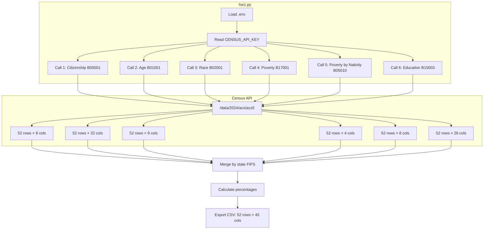
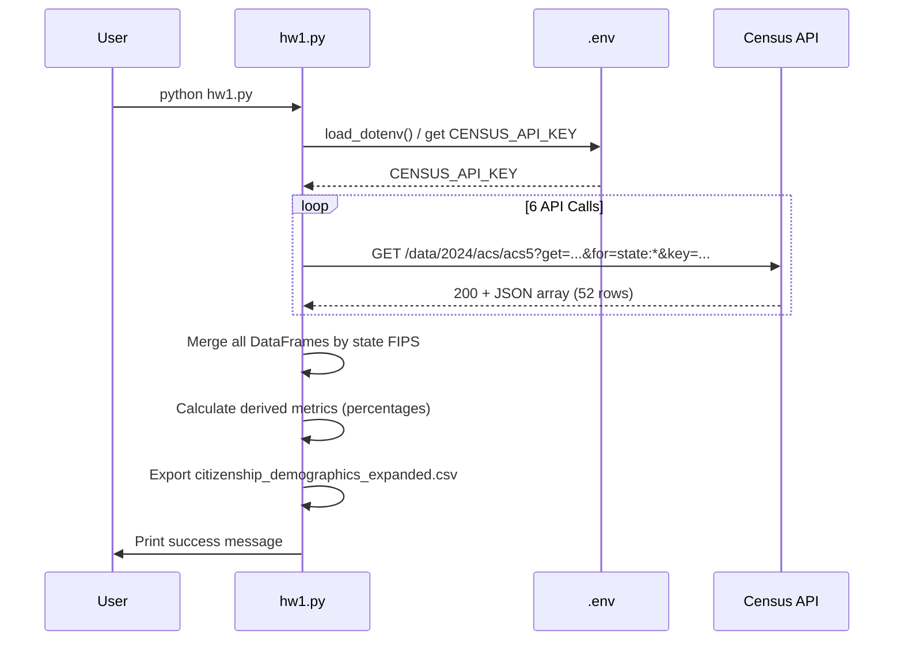

# Homework 1 — Expanded Census ACS & Shiny App

## 📋 Overview

`hw1.py` extends the original citizenship query (`lab1.py`) to include comprehensive demographic data relevant for ICE dashboard reporting. The script makes **six separate API calls** to the U.S. Census Bureau ACS 5-Year Estimates (2024) API, merges results by state FIPS code, and exports a unified CSV dataset with citizenship, age, race, poverty, and education metrics.

- **API:** U.S. Census Bureau – ACS 5-Year Estimates (2024)  
- **Data type:** Geographic / demographic (one row per state/territory)  
- **Record count:** 52 rows (50 states + DC + Puerto Rico)  
- **Columns:** 45 variables (citizenship, age, race, poverty, education)  
- **Use case:** Comprehensive demographic analysis for ICE dashboard context, state-level reporting, multi-dimensional comparisons

---

## 🔧 API Endpoint & Parameters

| Item | Value |
|------|--------|
| **Base URL** | `https://api.census.gov/data/2024/acs/acs5` |
| **Method** | GET |
| **Auth** | API key required (query parameter `key`) |
| **Geography** | `state:*` (all states + DC + PR) |

### Multiple API Calls

The script makes **six separate API calls** to different ACS tables:

#### Call 1: Citizenship Status (B05001)

| Parameter | Description |
|-----------|-------------|
| `get` | `NAME`, `B01001_001E`, `B05001_002E`, `B05001_003E`, `B05001_004E`, `B05001_005E`, `B05001_006E` |
| **Table** | B05001 (Citizenship Status) |
| **Variables** | 7 |

**Variable codes:**

| Code | Description |
|------|-------------|
| `NAME` | State/area name |
| `B01001_001E` | Total population |
| `B05001_002E` | U.S. citizen, born in the United States |
| `B05001_003E` | U.S. citizen, born in Puerto Rico or U.S. Island Areas |
| `B05001_004E` | U.S. citizen, born abroad of American parent(s) |
| `B05001_005E` | Naturalized U.S. citizen |
| `B05001_006E` | Not a U.S. citizen |

#### Call 2: Age Distribution (B01001)

| Parameter | Description |
|-----------|-------------|
| `get` | `NAME`, `B01001_001E`, plus 30 age-group variables (male/female, 18-34, 35-64, 65+) |
| **Table** | B01001 (Sex by Age) |
| **Variables** | 32 |

**Aggregated age groups:**
- **18-34:** Working-age young adults
- **35-64:** Prime working-age adults
- **65+:** Senior population

#### Call 3: Race/Ethnicity (B02001)

| Parameter | Description |
|-----------|-------------|
| `get` | `NAME`, `B02001_001E` through `B02001_008E` |
| **Table** | B02001 (Race) |
| **Variables** | 9 |

**Variable codes:**

| Code | Description |
|------|-------------|
| `B02001_001E` | Total |
| `B02001_002E` | White alone |
| `B02001_003E` | Black or African American alone |
| `B02001_004E` | American Indian and Alaska Native alone |
| `B02001_005E` | Asian alone |
| `B02001_006E` | Native Hawaiian and Other Pacific Islander alone |
| `B02001_007E` | Some other race alone |
| `B02001_008E` | Two or more races |

#### Call 4: Poverty Status (B17001)

| Parameter | Description |
|-----------|-------------|
| `get` | `NAME`, `B17001_001E`, `B17001_002E`, `B17001_031E` |
| **Table** | B17001 (Poverty Status in the Past 12 Months) |
| **Variables** | 4 |

**Variable codes:**

| Code | Description |
|------|-------------|
| `B17001_001E` | Total population for whom poverty status determined |
| `B17001_002E` | Income in past 12 months below poverty level |
| `B17001_031E` | Income in past 12 months at or above poverty level |

#### Call 5: Poverty by Nativity (B05010)

| Parameter | Description |
|-----------|-------------|
| `get` | `NAME`, `B05010_001E` through `B05010_007E` |
| **Table** | B05010 (Ratio of Income to Poverty Level by Nativity) |
| **Variables** | 8 |

**Variable codes:**

| Code | Description |
|------|-------------|
| `B05010_001E` | Total |
| `B05010_002E` | Native: Below 1.00 (poverty) |
| `B05010_003E` | Native: 1.00-1.99 |
| `B05010_004E` | Native: 2.00+ |
| `B05010_005E` | Foreign-born: Below 1.00 (poverty) |
| `B05010_006E` | Foreign-born: 1.00-1.99 |
| `B05010_007E` | Foreign-born: 2.00+ |

#### Call 6: Educational Attainment (B15003)

| Parameter | Description |
|-----------|-------------|
| `get` | `NAME`, `B15003_001E`, plus 24 education-level variables |
| **Table** | B15003 (Educational Attainment for Population 25 Years and Over) |
| **Variables** | 26 |

**Key education levels:**
- Less than high school (aggregated from `B15003_002E` through `B15003_016E`)
- High school graduate (`B15003_017E`)
- Some college/Associate's (`B15003_018E` through `B15003_021E`)
- Bachelor's degree (`B15003_022E`)
- Master's degree (`B15003_023E`)
- Professional degree (`B15003_024E`)
- Doctorate (`B15003_025E`)

**Documentation:**  
- [ACS 5-Year Data Sets](https://www.census.gov/data/developers/data-sets/acs-5year.html)  
- [ACS Technical Documentation](https://www.census.gov/programs-surveys/acs/technical-documentation.html)

---

## 📊 Data Structure

The script merges all six API responses into a **single CSV file** (`citizenship_demographics_expanded.csv`):

- **Rows:** 52 (one per state/territory)
- **Columns:** 45 variables

### Column Layout

#### Citizenship Variables (from Call 1)

| Column | Description |
|--------|-------------|
| `state` | State FIPS code (2-digit string) |
| `state_name` | State/area name |
| `total_population` | Total population estimate |
| `non_citizen` | Count of non-U.S. citizens |
| `naturalized` | Count of naturalized U.S. citizens |
| `foreign_born` | Count of foreign-born (naturalized + non-citizen) |
| `pct_non_citizen` | Percent of population that is non-citizen |
| `pct_foreign_born` | Percent of population that is foreign-born |
| `pct_naturalized` | Percent of population that is naturalized |

#### Age Variables (from Call 2)

| Column | Description |
|--------|-------------|
| `age_18_34` | Count of population ages 18-34 |
| `age_35_64` | Count of population ages 35-64 |
| `age_65_plus` | Count of population ages 65+ |
| `pct_age_18_34` | Percent of population ages 18-34 |
| `pct_age_35_64` | Percent of population ages 35-64 |
| `pct_age_65_plus` | Percent of population ages 65+ |

#### Race Variables (from Call 3)

| Column | Description |
|--------|-------------|
| `race_white` | Count of White alone population |
| `race_black` | Count of Black or African American alone |
| `race_asian` | Count of Asian alone |
| `pct_race_white` | Percent White alone |
| `pct_race_black` | Percent Black or African American alone |
| `pct_race_asian` | Percent Asian alone |
| `pct_race_other` | Percent other races (AI/AN, NH/PI, other, two or more) |

#### Poverty Variables (from Call 4)

| Column | Description |
|--------|-------------|
| `below_poverty` | Count below poverty level |
| `at_or_above_poverty` | Count at or above poverty level |
| `pct_below_poverty` | Percent below poverty level |

#### Poverty by Nativity Variables (from Call 5)

| Column | Description |
|--------|-------------|
| `fb_below_poverty` | Foreign-born count below poverty |
| `pct_fb_below_poverty` | Foreign-born percent below poverty |
| `native_below_poverty` | Native-born count below poverty |
| `pct_native_below_poverty` | Native-born percent below poverty |

#### Education Variables (from Call 6)

| Column | Description |
|--------|-------------|
| `edu_less_than_hs` | Count with less than high school (25+) |
| `edu_high_school` | Count with high school diploma (25+) |
| `edu_some_college` | Count with some college/associate's (25+) |
| `edu_bachelors` | Count with bachelor's degree (25+) |
| `edu_masters` | Count with master's degree (25+) |
| `edu_professional` | Count with professional degree (25+) |
| `edu_doctorate` | Count with doctorate (25+) |
| `edu_bachelors_plus` | Count with bachelor's or higher (25+) |
| `pct_edu_less_than_hs` | Percent less than high school (25+) |
| `pct_edu_high_school` | Percent high school (25+) |
| `pct_edu_some_college` | Percent some college/associate's (25+) |
| `pct_edu_bachelors` | Percent bachelor's (25+) |
| `pct_edu_masters` | Percent master's (25+) |
| `pct_edu_professional` | Percent professional (25+) |
| `pct_edu_doctorate` | Percent doctorate (25+) |
| `pct_edu_bachelors_plus` | Percent bachelor's or higher (25+) |

**Note:** All counts are **estimates**. Percentages are calculated from counts and rounded to 2 decimal places. Education variables apply to population **25 years and over** only.

---

## 📈 Mermaid Diagram



**Request → response flow:**



---

## 🚀 Usage Instructions (Expanded query)

### 1. Prerequisites

- **Python 3** with required packages:

  ```bash
  pip install requests pandas python-dotenv
  ```

- A **Census API key** from [api.census.gov](https://api.census.gov/data/key_signup.html).

### 2. Configure API key

The script looks for `CENSUS_API_KEY` in `.env` files in this order:
1. `lab2/.env` (Shiny app location)
2. `app/.env` (alternative app location)
3. `hw1/.env` (current directory)
4. Parent `.env`

Create or update one of these `.env` files:

```env
CENSUS_API_KEY=your_census_api_key_here
```

Do not commit `.env` or your key to version control.

### 3. Run the script

From the `hw1` directory:

```bash
python hw1.py
```

### 4. Expected output

The script will:
- Print progress for each API call
- Merge all datasets by state FIPS
- Export `citizenship_demographics_expanded.csv` (52 rows, 45 columns)
- Print a summary of included data categories

**Example output:**

```
Fetching Census ACS data...
  Call 1: Citizenship status...
  Call 2: Age distribution...
  Call 3: Race/ethnicity...
  Call 4: Poverty status...
  Call 5: Poverty by nativity...
  Call 6: Educational attainment...

Merging all datasets by state FIPS...

[SUCCESS] Wrote citizenship_demographics_expanded.csv (52 rows, 45 columns)

Dataset includes:
  - 52 states/territories
  - Citizenship: non-citizen, naturalized, foreign-born counts and rates
  - Age: 18-34, 35-64, 65+ counts and percentages
  - Race: White, Black, Asian, Other percentages
  - Poverty: Overall and foreign-born specific rates
  - Education: Key attainment levels (high school, bachelor's, master's, etc.)
```

### 5. Error handling

The script includes error handling for:
- Missing or invalid API key
- Network errors (timeout, connection failures)
- API errors (non-200 status codes, invalid JSON)
- Missing data (empty responses)

Errors are printed to stderr with clear messages.

---

## 🚀 Shiny app usage (HW1 dashboard)

This section explains how you use the **Homework 1 Shiny dashboard** that visualizes the expanded Census data and Vera ICE trends.

### 1. Prerequisites

- **Python 3** with the HW1 app dependencies:

  ```bash
  cd 5381-activities/hw1
  pip install -r requirements.txt
  ```

### 2. Prepare data files

From the `5381-activities/hw1` directory, run:

```bash
# 1) Fetch and expand Census ACS demographics (this produces citizenship_demographics_expanded.csv)
python hw1.py

# 2) Join Census + Vera facility data into a single state-level CSV (census_vera_joined.csv)
python join_census_vera.py

# 3) Download Vera national ICE detention trends into data/national.csv
python download_vera_national.py
```

After these steps, you should have:

- `citizenship_demographics_expanded.csv` — expanded Census demographics by state  
- `census_vera_joined.csv` — Census + Vera facilities joined by state  
- `data/national.csv` — Vera national daily detention populations

### 3. Run the Shiny app

Still from `5381-activities/hw1`:

```bash
python -m shiny run --reload app.py
```

Then open the URL printed in the terminal (typically `http://127.0.0.1:8000`) in your browser.

### 4. What you will see

- **Dark-themed dashboard** titled `ICE & Demographics Dashboard`  
- **Left sidebar**:
  - `Map shows` dropdown to choose the heat map metric:
    - `Detention activity (facility count)` → `ice_facility_count`
    - `% foreign-born` → `pct_foreign_born`
    - `% non-citizen` → `pct_non_citizen`
- **Top card – Heat map – detention & demographics**:
  - US map on a black background, colored from dark red to orange.
  - Hover shows state name and the selected metric value.
- **Bottom card – National ICE detention trends**:
  - Line chart over time with:
    - Midnight population (bright red).
    - 24-hour population (orange).

### 5. Troubleshooting

- If the app shows an error about **missing `national.csv`**, re-run:

  ```bash
  python download_vera_national.py
  ```

- If the map appears blank for some metric, confirm that `census_vera_joined.csv` has non-null values for that column and re-run `join_census_vera.py` if needed.

---

## 📝 Summary

| Item | Detail |
|------|--------|
| **Scripts** | `lab1.py`, `hw1.py`, `join_census_vera.py`, `download_vera_national.py`, `app.py` |
| **APIs / Data** | U.S. Census Bureau ACS 5-Year (2024); Vera ICE detention trends (facilities + national) |
| **Endpoint (Census)** | `https://api.census.gov/data/2024/acs/acs5` |
| **API Calls** | 6 ACS tables (Citizenship, Age, Race, Poverty, Poverty by Nativity, Education) |
| **Records (Census)** | 52 (states + DC + PR) |
| **Columns** | 45 Census variables + joined ICE facility counts |
| **Expanded Outputs** | `citizenship_demographics_expanded.csv`, `census_vera_joined.csv`, `data/national.csv` |
| **Shiny App** | `app.py` (choropleth + national trends) |
| **Config** | `CENSUS_API_KEY` in `.env` (for Census queries); Vera data fetched via helper scripts |

